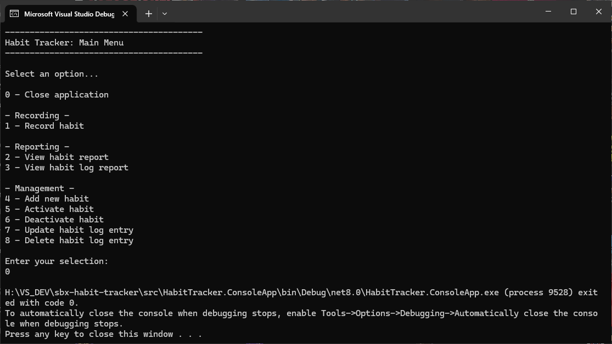
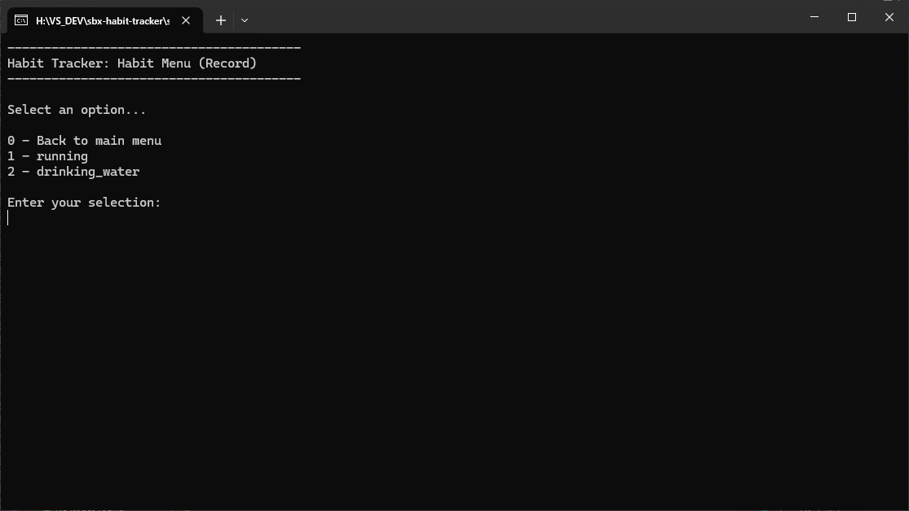
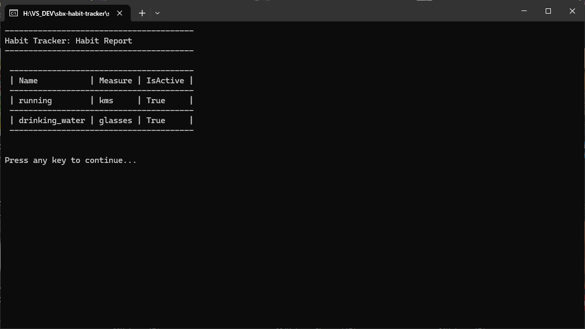
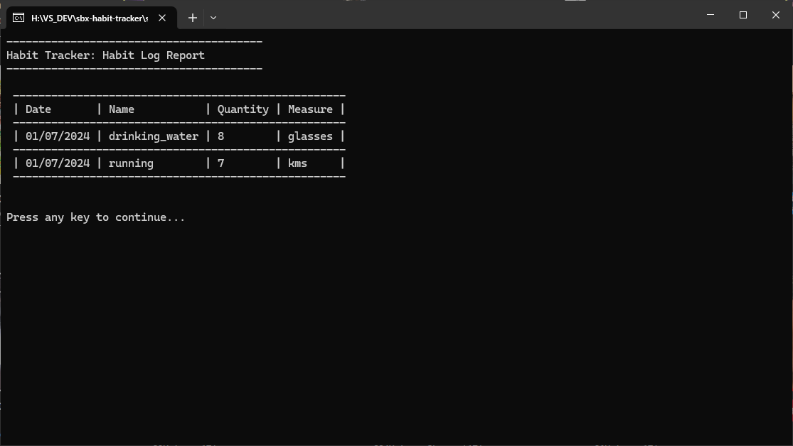
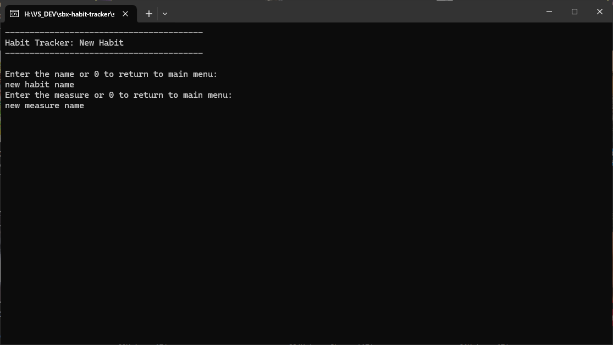
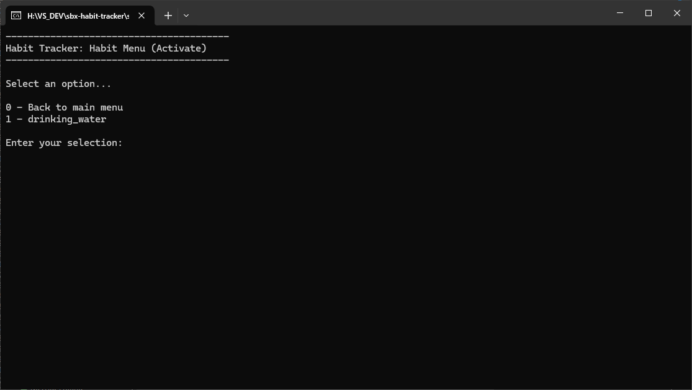
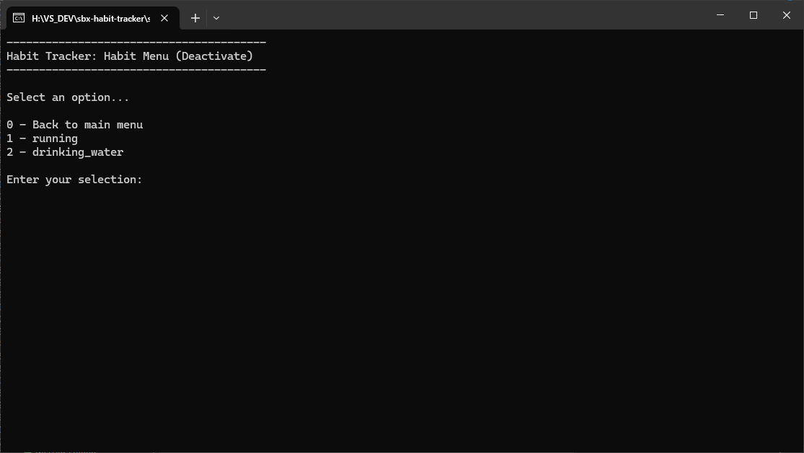
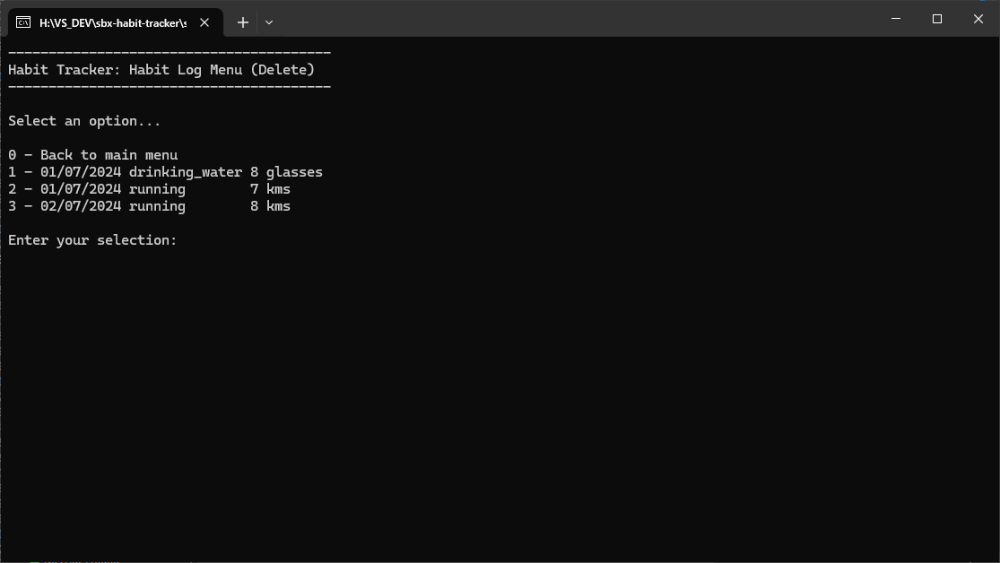
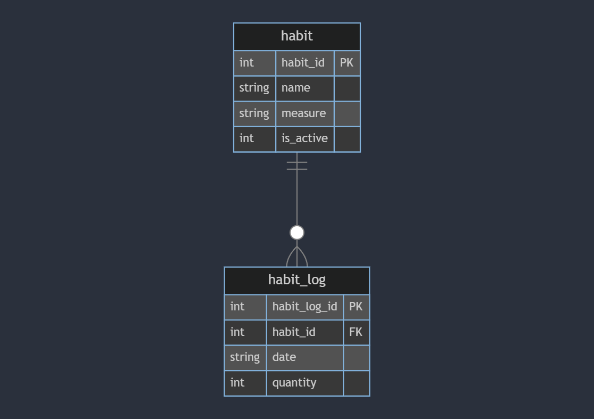

<h1>Habit Tracker</h1>

Welcome to the Habit Tracker App!

This is a simple interactive application that was built as a demo application to demonstrate CRUD operations against a database.

It is run as a console application and allows a user to create create, read, update and delete habit records with an sqlite database backend.

## Features

The application is a console based user interface where users can navigate the following functionality with key presses:

- **Recording**
 
	Prompts the user for inputs, validates inputs, then creates a new habit log entry in the database.

- **Reporting**:

	View all habits or habit log entries from the database and displays them in the console using the [Console Table Ext](https://github.com/minhhungit/ConsoleTableExt) library.

- **Management**

	Manage all entries in the database. Add, activate, or deactivate habits. Update or delete habit log entries.

- **Database Seeding**

	Turn on `GenerateSeedData` in appsettings.json if you wish to generate test data on initial database creation.

## Usage

When you start the application, you will be presented with the main menu:

Choose option **0** to close the application:

Choose option **1** to record doing a habit:
- If there are active habits:
	- You will then be presented with the habit menu.
	- Enter the habit to record against.
	- Enter the Date and Quantity.
- If there are no active habits:
	- You will be unable to record a habit.

Choose option **2** to view the habit report:

Choose option **3** to  view the habit log report:

This option now allows you to select all or specific habits to report on, and optionally specify a date range. This will allow you to see the sum of a habits quantity over the date range.

Choose option **4** to add a habit to record against:

Choose option **5** to activate an inactive habit:
- If there are inactive habits:
	- You will then be presented with the habit menu.
	- Enter the habit to activate.
- If there are no inactive habits:
	- You will be unable to activate a habit.

Choose option **6** to deactivate an active habit:
- If there are active habits:
	- You will then be presented with the habit menu.
	- Enter the habit to deactivate.
- If there are no active habits:
	- You will be unable to deactivate a habit.

Choose option **7** to update a habit log entry:

Choose option **8** to delete a habit log entry:

## How It Works

- **Menu Navigation**: Navigate the application through the menu options to perform an action.
- **Data Storage**: A new sqlite database is created and the required schema is set up at run-time, or an existing database is used if previously created.
- **Data Seeding**: If the associated configuration setting is set and there are no habits in the database, a set of mock habits will be added, as well as 100 random habit logs
- **Report Display**: Uses the library [Console Table Ext](https://github.com/minhhungit/ConsoleTableExt) to display structured and formatted tables.

## Database

## Contributing

Contributions are welcome! Please fork the repository and create a pull request with your changes. For major changes, please open an issue first to discuss what you would like to change.

## Contact

For any questions or feedback, please open an issue.

---
***Happy Habit Tracking!***
