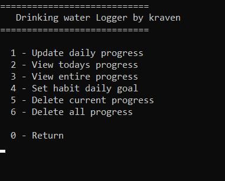
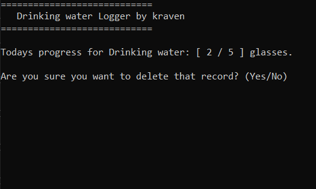

# Console Habit Logger  

This is the Console Habit Logger app, created for [The C# Academy](https://www.thecsharpacademy.com/#), based on the requirements listed in the project.
The purpose of this app, is to learn and implement CRUD operations with SQLite database inside a Console application.

## Requirements  

- [x] This application should register one habit.
- [x] This habit can't be tracked by time (ex. hours of sleep), only by quantity (ex. number of water glasses a day).
- [x] The application should store and retrieve data from a real database
- [x] When the application starts, it should create a sqlite database, if one isn’t present.
- [x] It should also create a table in the database, where the habit will be logged.
- [x] The app should show the user a menu of options.
- [x] The users should be able to insert, delete, update and view their logged habit.
- [x] You should handle all possible errors so that the application never crashes.
- [x] The application should only be terminated when the user inserts 0.
- [x] You can only interact with the database using **raw SQL**. You can’t use mappers such as Entity Framework.
- [x] Your project needs to contain a Read Me file where you'll explain how your app works. 

- [x] CHALLENGE: Let the users create their own habits to track. That will require that you let them choose the unit of measurement of each habit.

 ## App Overview  
 
 - The App comes with a self-contain database, which is created on first startup. It is a single file, named "HabitTrackerDB" and can be copied and shared among users. If the database will become corrupted (or deleted) a new one will be created when the app is launched.
 - The app allows for creation of countless habits to track and viewed via a Console UI 
 
    
    
- The app always assumes the data enter into it is from the present day (because you know... it's suppose to be a habit).
- The app allows for viewing, updating and deleting present day information, or all information. Such operation is performed for each habit separately.
- List view is provided for both current day progress and entire progress so far

    
    
- Habit Logger also allows for deletion of either present day information, or entire progress.
- Additional confirmation is required when deleting records, to prevent unfortunate accidents :)

    

## Technology Used  

- Habit Logger is powered by .NET 7
- All coding done via Visual Studio 2022
- SQlite Database is handled by System.Data.Sqlite.Core libraries. No Object Relation Mappers (ORM) were used.
- DB Browser for SQLite to test SQL statements and how they affect the database.

## Challenges  

- SQLite proved to be a bit of a problem, since it does come with restrictions in comparison to SQL Server in terms of keywords, which required a few rewrites to make it work. One of which was the *ON CONFLICT* keyword (SQLite equivalnt of Upsert), which I used to handle a Upsert-style statements. It worked great, until the app were supporting multiple habits. 
- Working without ORM wasn't that much of a problem, but did require a study of the ADO.NET documentation to understand it properly. Also, all reading from database methods were longer that I would like, and I spend more time thinking about the design of said methods, than I probably should.
- A bit personal, but the hardest part of the app (and any app really) for me is the very beginning. Where and how to start is still a big, scary monster. After that, when the app starts to shape, it becomes easier to add another features into it.
- Dates are hard. This is why I designed the app, so that incorrect date input from the user is not even an option. One drawback of this solution, is that displayed date format is dd.mm.yyyy which may confuse western users.

## Lessons Learned  

- Don't try to solve multiple problems at once. The *ON CONFLICT* mentioned above in one of the examples. Between studying and understanding the documentation regarding how this clause works and implementation to fit my app, It took much longer than it would, if I made it separate. Which I did at the end.
- Just do something. This might be a personal issue, but very much relevant. Since the project required the use of stuff I havent's dealt with much or at all, I spend an increadible amount of time (like half of the total time) on reading multiple sources regarding SQLite and ADO.NET so I knew how to implement it. And I've been reading everything I could find. Thing is - I haven't used even 10% of what I read about, it would be more beneficial to just start, and read only about the thing you actuall need, when you need it.
- GIT and small test projects are your friend. It makes you not worry about messing up the stuff you already created.

## Resources used

- Pablo and the entire [C# Academy](https://www.thecsharpacademy.com/#) community
- [Tim Corey C# Masterclass](https://courses.iamtimcorey.com/) and his [YouTube channel](https://www.youtube.com/@IAmTimCorey)
- [W3Schools](https://www.w3schools.com/) to brush up my SQL
- [MS Learn](https://learn.microsoft.com/en-us/) and the ADO.NET documentation
- [DB Browser for SQLite](https://sqlitebrowser.org/)
- google, stack and reddit

