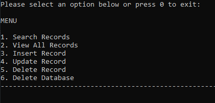
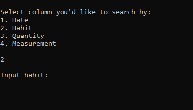
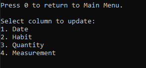
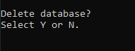

# Habit Logger

CRUD application for logging habits using C# and SQLite.
 

# Requirements

- This is an application where you’ll register one habit.
- This habit can't be tracked by time (ex. hours of sleep), only by quantity (ex. number of water glasses a day).
- The application should store and retrieve data from a real database.
- When the application starts, it should create a sqlite database, if one isn’t present.
- It should also create a table in the database, where the habit will be logged.
- The app should show the user a menu of options.
- The users should be able to insert, delete, update and view their logged habit.
- You should handle all possible errors so that the application never crashes.
- The application should only be terminated when the user inserts 0.
- You can only interact with the database using raw SQL. You can’t use mappers such as Entity Framework.
- Must contain a Read Me file.
 

# Usage

- Creates a SQLite database on execution
- Seeds database with 100 randomized records if no data exists
- Users navigate the menu by key presses
    - 
- Functions include:
  - Searching the database.
  - Users can select column and input a search term.
    - 
  - Viewing all records.
  - Inserting a record.
	- Application ensures date is the correct format (dd-mm-yy).
  - Updating records.
	- Allows user to update specific columns.
    - 
  - Deleting records.
  - Deleting the database.
	- Allows user to cancel the action if warranted.
    - 
 

# Challenges

- First time working with SQLite. I had difficulty in particular with understanding how to display the data using the reader and lists.
- I did try to consider the structure of the application before writing it but,
  even with pseudocode it still ended up getting a bit out of control with the amount of functions I wrote.
- Had to spend some time learning about DateTime structure in order to seed the database with randomized dates.
- I tried to implement handling exceptions in my code but,
  am not very familiar with it outside of what I learned in the C# Microsoft FreeCodeCamp course.
  I spent a little time researching where it's considered good practice to use them.
 

# Known Issues

- The Id's are currently hardcoded. Inserting a record with an Id of 1 would appear after record with an Id of 100.
- Dates are randomized but don't appear in a timely order when database is seeded.
 

# Areas to Improve

- Writing clean code. I was more focused on making sure the application worked but, I feel that I need to work on making my code more readable and optimized.
- Exception handling. As mentioned above, I struggled with how and where to implement this, especially with SQLite.
  I ended up just following some of Microsoft's documentation on it.
  Found [here](https://learn.microsoft.com/en-us/dotnet/api/microsoft.data.sqlclient.sqlexception?view=sqlclient-dotnet-standard-5.2).
- Using SQLite, especially with using constraints. I think this will come with practice but, I do not have a strong foundation in this currently.
- Using optional arguments in methods. I think there were some scenarios where utilizing this would've made the application simpler.
[EOF]