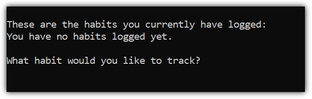
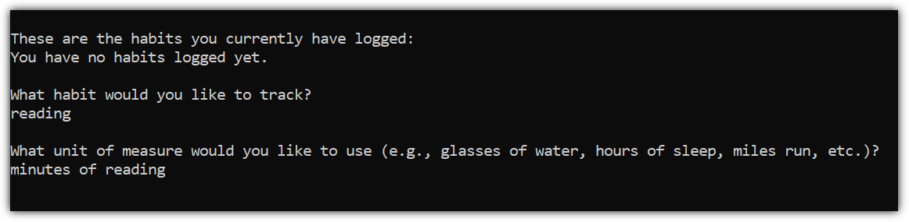
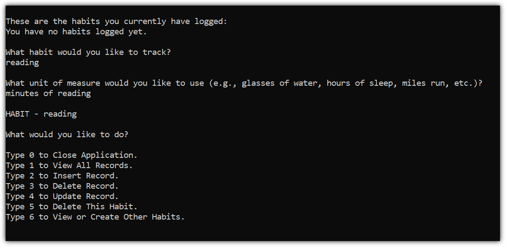
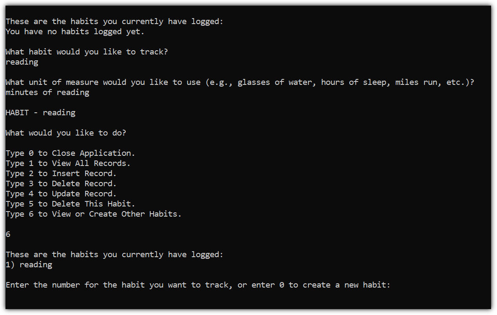

# HabitLogger

This is my first CRUD application. It's the first thing I've created that interacts with a database. I built it using C# and SQLite. This project is part of the curriculum from [The C# Academy](https://www.thecsharpacademy.com/).

## Requirements

- [x] This is an application where you’ll register one habit.
- [x] This habit can only be tracked by quantity (ex. number of water glasses a day)
- [x] The application should store and retrieve data from a real database
- [x] When the application starts, it should create a sqlite database, if one isn’t present.
- [x] It should also create a table in the database, where the habit will be logged.
- [x] The app should show the user a menu of options.
- [x] The users should be able to insert, delete, update and view their logged habit.
- [x] You should handle all possible errors so that the application never crashes.
- [x] The application should only be terminated when the user inserts 0.
- [x] You can only interact with the database using raw SQL. You can’t use mappers such as Entity Framework.
- [x] Your project needs to contain a Read Me file where you'll explain how your app works.

## Challenge Feature

- [x] Let the users create their own habits to track. That will require that you let them choose the unit of measurement of each habit.

## Getting Started

Upon initially running the program, it will check whether there are any existing habits created. If not, the user will be asked what habit they would like to start tracking:

Entering the habit name and pressing enter will create the table for that habit. You will then be asked for the unit of measure for that habit:

After entering the habit and its unit of measure, you will see the menu for that habit:

To switch between habits or to create other habits, select 6 from the habit menu:

## Try It Out!

[HabitLogger](https://replit.com/@lepros/HabitLogger)

