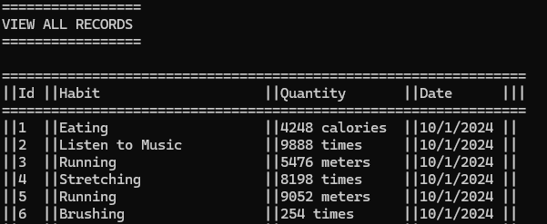

# Habit Logger

This is a simple project to track your habits

## How it works

### The project
This is a console application using sqlite as the database. The user uses the numpad most of the times to choose the desired options. In some menus, certains keys like 's' and 'b' are also valid. These menus tell you if you can use this options and they also explicitly state what each option does.
There are also a bunch of restrictions regarding validation. With that in mind, the program has a bunch of if conditions to validate dates, numbers, names, etc., depending on the context. As such, all the inputted values are properly validated.

The habits are also stored in a .txt file. Since this is really simple date, there's no need to add a new table to a database. This is also not hardcoded because it's easier to manipulate this way and saves the new habits that a new user might want to add.

### Main Menu
From this menu you can choose 5 options
- View All Records
- Insert Record
- Delete Record
- Update Record
- Insert New Habit

### View All Records
As the name suggests, this shows all the records in the database. Upon starting, if no database is present, the program creates a new one and populates with 100 elements with random values, using todays date. Some of the values naturally don't make sense, but the point of populating is more for testing than to be realistic

### Insert Record
This menu is for inserting new records in the database. The first option that appears is to add the habit that you want to add. You must add an existing habit for it to be valid (a warning message appears if it's not valid). The user can also press 's' to check the available habits and 'b' to go back.

After this menu, you must input the date in the YYYY-MM-DD format (that's properly validated).

Finally it asks you the number of the measure of the habit. This measure is always the same for the same habit (calories for eating, "times" for drinking, etc.).

### Delete Record
This menu is for deleting records from the database. It asks you to input the id you want to remove. It also lets you check all records from the database by pressing 's'.
After a valid id is inputted, the record is deleted-

### Update Record
This menu is for updating records from the database. You first need to input the desired ID to alter (you can press 's' to show all the records from the db).

After that, you can choose to change the Habit, the Date, or the Quantity of the measure. If the user decided to change either the Date or the Quantity of the measure, he only need to input the necessary information and the record will be updated accordingly. However, if the user chooses to change the Habit, he will have to change both the habit and the quantity of the measure.

### Insert new Habit
This menu is for inserting a completely new Habit. You need to first input the new Habit you want to add (it must be a new habit, it checks if the inputted habit is present in the db), and, after that, you input the measure you want the habit to be (it can be a new one or an existing one). After that, the habit can be used just like all the others. Even if the user closes and opens the program again, the habit will still be present.