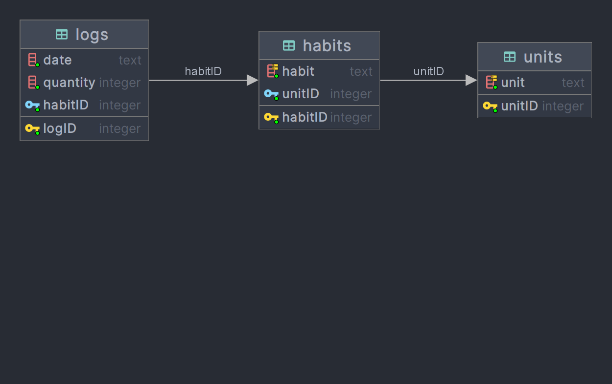

# Habit logger

## Table of contents
- [About](#about)
- [Features](#features)
- [ER Diagram](#er-diagram)

## About
CRUD application design to create and track different habits.

## Features
- Program connects to sqlite database. If you want to restore 
data copy `database-copy.db` to project folder and rename it to `database.db`
- Console based UI where user can view, create, update and delete his logs, 
habits and units
- User can filter logs by selecting starting and ending date

## ER Diagram
