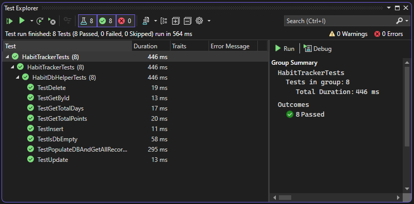

# Habit Tracker Project
##### Thomas Henley, C# Academy

## Introduction
Modern fitness trackers use heart rate monitoring to calculate their wearer's cardiovascular activity.
These devices use different conversion levels for different levels of physical activity to award "points", often with a recommendation for how many the user should aim for in a day.

This project allows users to track their heart points independently, giving them the ability to adjust values as they see fit. All records are persisted permanently in a SQLite database.

## Usage
Users will see a menu upon launching the application:

```
=======================================

        MAIN MENU

        What would you like to do?

        Type 0 to Close Application.
        Type 1 to View All Records.
        Type 2 to Insert Record.
        Type 3 to Delete Record.
        Type 4 to Update Record.
        Type 5 to View Total Number of Days Exercised.
        Type 6 to View Total Heart Points.
        Type 7 to View Total Heart Points by Year.

-----------------------------------------------
```

The user enters a number to make their selection:

0. Exits the application.
1. Displays a list of all entries with dates and point values.
1. Prompts the user for a date and point value to add an entry.
1. Prompts the user for a record ID and deletes the corresponding entry from the database.
1. Prompts the user for a record ID, then allows them to update the date and points for that entry.
1. Displays the total number of days on which the user exercised. Multiple entries for the same day only count as one.
1. Views the sum total of all cardio points in the user's history.
1. Prompts the user to enter a year, and shows the total points earned in that year.

#### Note: The database is created and populated with 100 randomized entries for demonstration purposes when the program is run for the first time.

## Testing
The solution includes a small xUnit test project, `HabitTrackerTests`, to exercise the methods attached to the HabitDbHelper class.
To run the tests:
1. Build the solution.
1. Open the "Test Explorer" in Visual Studio.
1. Run All Tests.

