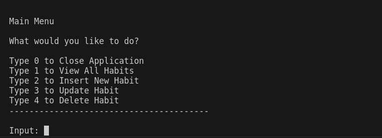

# Habit Logger
This is a Console based CRUD application to track habits and measure spent on it.
Developed using C# and SQLite.

# Given Requirements:

- [x] When the application starts, it should create a sqlite database, if one isn’t present.

- [x] You need to be able to insert, delete, update and view your logged habits.

- [x] The app should show the user a menu of options.

- [x] You should handle all possible errors so that the application never crashes.

- [x] The application should only be terminated when the user inserts 0.

- [x] You can only interact with the database using raw SQL. You can’t use mappers such as Entity Framework.

# Features

- SQLite database connection

- The program uses a SQLite db connection to store and read information.

- If no database exists, or the correct table does not exist they will be created on program start.

- A console based UI where users can navigate by key presses

- 

- CRUD DB functions

- From the main menu users can Create, Read, Update or Delete entries for whichever habit they want, entered in mm-DD-yyyy format.

- Time and all inputs are checked to make sure they are in the correct and realistic format.

- 

# Challenges

- It was my first time using SQLite. I had to learn each of these technologies from the beginning in order to complete this project.

- DateTime was a hurdle to get over. I had to learn how to parse into and from DateTime into either more storable or human readable formats. I learnt about the various forms of date and how to convert to string form.

# Lessons Learned

- I had to do a lot of debugging in this project and it has help to train me on how to properly solve bugs in my code.

- principles, Since I learnt about some of the SOLID Principles, I have always tried to implement it in my codes, especially Dependency Injection. This project was a good way to improve in that skill.

# Areas to Improve

- My code structure need some improvements. I would like to immediate know how to separate my classes and intervals into files at first look.
