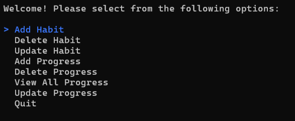
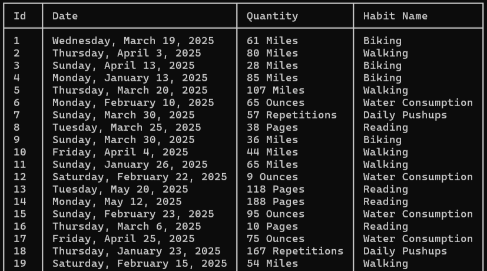

# Habit Tracker Console App

A simple habit logging application built with **C#** and **ADO.NET**. This app allows users to track daily habits and store their progress in a local database.

## Features

- Add, view, update, and delete habit entries
  
- Track multiple habits with dates and quantities
  
- Data persistence using ADO.NET and a local database (e.g., SQLite)
- If no database exists, seed data will populate the database for testing

## Technologies Used

- C#
- .NET Console Application
- ADO.NET
- SQLite (or other supported databases)
