# Habit Logger

Using guidelines from The C# Academy course ([link to task](https://thecsharpacademy.com/project/12/habit-logger)) made a console application where user can log occurrences of a habit.  
The user can create their own habits to track, and the application allows them to input the date of the occurrence of the habit.  
The application also allows the user to insert, delete, update and view their logged habits.

--- 
### Technologies Used:  
- C# 12.0
- .NET 8
- SQLite (via ADO.NET)  
- Spectre.Console (for enhanced console UI)

### Requirements and challanges:
- [x] Create a console application where you’ll log occurrences of a habit.
- [x] This habit can't be tracked by time (ex. hours of sleep), only by quantity (ex. number of water glasses a day)
- [x] Users need to be able to input the date of the occurrence of the habit
- [x] The application should store and retrieve data from a real database
- [x] When the application starts, it should create a sqlite database, if one isn’t present.
- [x] It should also create a table in the database, where the habit will be logged.
- [x] The users should be able to insert, delete, update and view their logged habit.
- [x] You should handle all possible errors so that the application never crashes.
- [x] You can only interact with the database using ADO.NET. You can’t use mappers such as Entity Framework or Dapper.
- [x] Follow the DRY Principle, and avoid code repetition.
- [x] Your project needs to contain a Read Me file where you'll explain how your app works. 
- [x] Let the users create their own habits to track. That will require that you let them choose the unit of measurement of each habit.
- [x] If you haven't, try using parameterized queries to make your application more secure.
- [x] Seed Data into the database (made adjustment that user can choose if/when and how much data to add)   
- [x] Create a report functionality where the users can view specific information 

### Improvements Made:
- Database Wipe Option: Added functionality to delete all data from the database, allowing users to start fresh.
- User Confirmation: Implemented a confirmation prompt before wiping the database to prevent accidental data loss.
- ID Reset on Wipe: Ensured that IDs reset when all data is wiped.
- Spectre.Console Integration: Enhanced the user interface with styled prompts, tables, and better visuals.
- Custom Habits: Users can now create habits with custom names and units of measurement.
- Random Data Seeding: Added functionality to seed the database with random habits and records for testing.
- Error Handling: Improved input validation and error handling to prevent crashes.
- DRY Principle: Refactored repetitive code into reusable methods (e.g., displaying tables).
- File-Scoped Namespaces: Reduced nesting for cleaner code.
- Descriptive Command Names: Improved readability by using descriptive variable names for database commands.  
> Before:   `command.ExecuteNonQuery();`  = generic, but can be confusing if you have multiple commands  
> After:    `deleteCmd.ExecuteNonQuery();` = more descriptive (better readability)  
- Flexible Data Structures: Replaced arrays with lists for better flexibility. + using same structure and/or improve readability.   
> Before:   `using (var connection = new SqliteConnection(connectionString)))`  
> After:    `using (SqliteConnection connection = new(connectionString))` 
- Seperated Methods: Organized code into separate files for better readability and maintainability.  

---
## Project Structure
The project is organized into multiple files for better readability and maintainability:  
- Program.cs: Entry point of the application. Handles database creation and the main menu.
- Database:
	- DatabaseConfig.cs: Contains the connection string for the SQLite database.
	- DatabaseOperations.cs: Handles database-related operations like wiping data and seeding random data.
- Helpers:
	- HelperMethods.cs: Contains reusable methods for input validation, displaying tables, and generating random data.
- Operations:
	- HabitOperations.cs: Manages CRUD operations for habits.
	- RecordOperations.cs: Manages CRUD operations for records.
	- SearchOperations.cs: Handles specific search and reporting functionalities.
- Menus:
	- MenuOptions.cs: Contains the logic for navigating between different menus.
- Models:
	- DataModels.cs: Defines the data models for habits and records.
---
## Example Usage  

- When starting the application, the user is presented with a Main Menu and can navigate to submenus and/or other choices.      

&nbsp;&nbsp;&nbsp;&nbsp;&nbsp;&nbsp;&nbsp;&nbsp;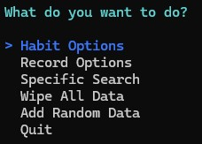 &nbsp;&nbsp;&nbsp;&nbsp;&nbsp;&nbsp;&nbsp;&nbsp;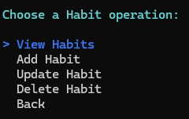

- In this case - to see all habits.

&nbsp;&nbsp;&nbsp;&nbsp;&nbsp;&nbsp;&nbsp;&nbsp;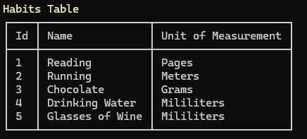

- If want to add Random Data, user will be asked to delete old data first and how many new records to add.

&nbsp;&nbsp;&nbsp;&nbsp;&nbsp;&nbsp;&nbsp;&nbsp;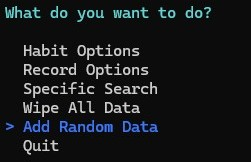  
&nbsp;&nbsp;&nbsp;&nbsp;&nbsp;&nbsp;&nbsp;&nbsp;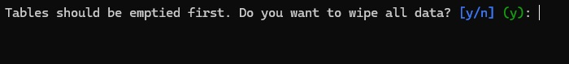  
&nbsp;&nbsp;&nbsp;&nbsp;&nbsp;&nbsp;&nbsp;&nbsp;  

- User can choose to use Specific Search. One of them is to see chart of all habits (have added custom habbit with 1 entry as an extra example)  

&nbsp;&nbsp;&nbsp;&nbsp;&nbsp;&nbsp;&nbsp;&nbsp;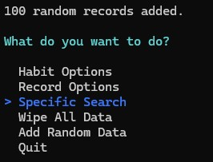  
&nbsp;&nbsp;&nbsp;&nbsp;&nbsp;&nbsp;&nbsp;&nbsp;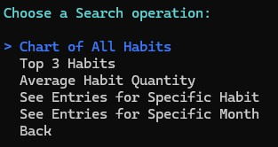  
&nbsp;&nbsp;&nbsp;&nbsp;&nbsp;&nbsp;&nbsp;&nbsp;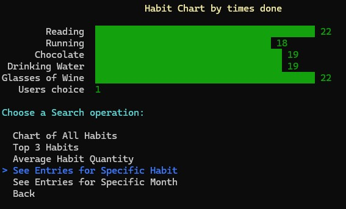  

- User can continue to see entries for specific habit  
&nbsp;&nbsp;&nbsp;&nbsp;&nbsp;&nbsp;&nbsp;&nbsp;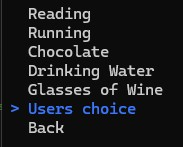  
&nbsp;&nbsp;&nbsp;&nbsp;&nbsp;&nbsp;&nbsp;&nbsp;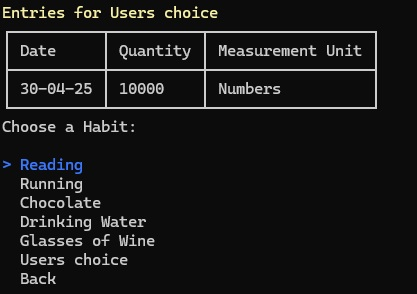  

- When done, just exit the application.  
&nbsp;&nbsp;&nbsp;&nbsp;&nbsp;&nbsp;&nbsp;&nbsp;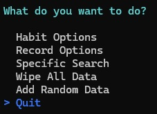  
&nbsp;&nbsp;&nbsp;&nbsp;&nbsp;&nbsp;&nbsp;&nbsp;  

---