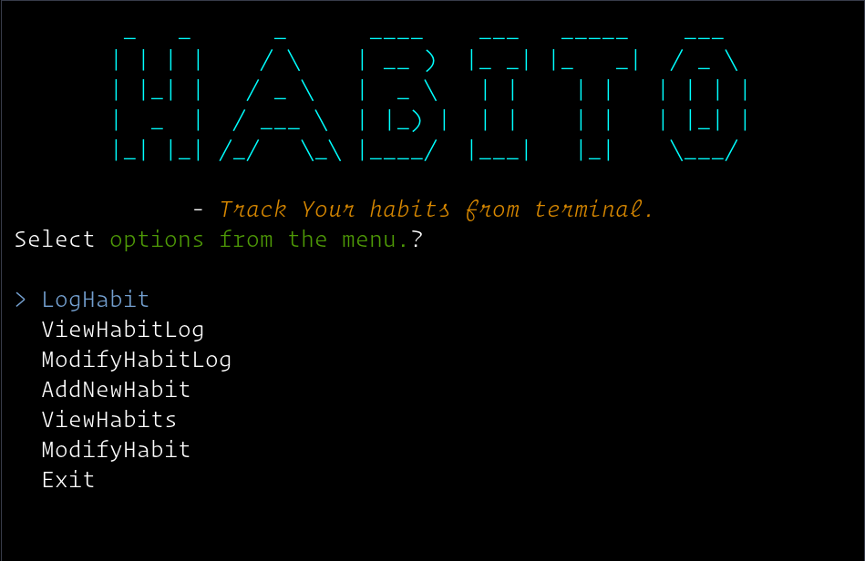
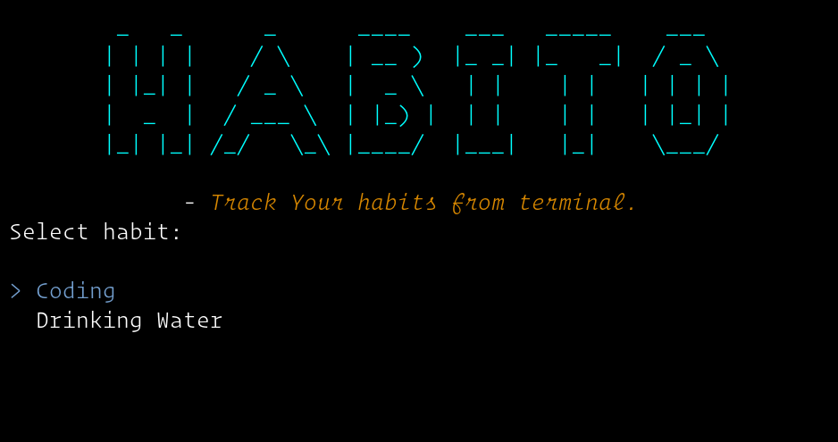
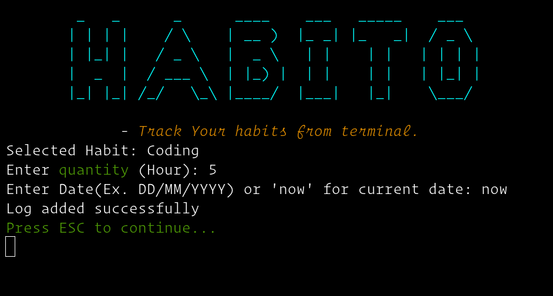
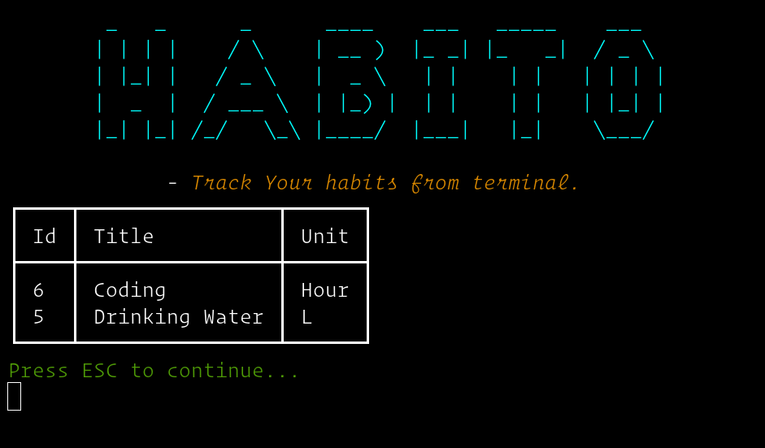
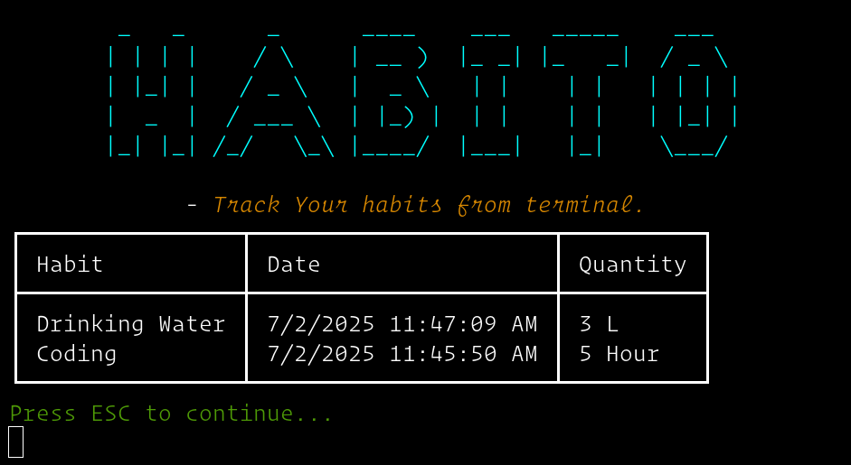

# HABITO
#### *Track Your habits from terminal.*

---------------

### Tech
- .NET(v8.0).
- SQLite.
- Spectre.Console

### Features
- Keyboard Based Navigation.
  
- Easier selection based Inputs & Logging.
  
- Easy way to insert current date.
  
- Tabular View of Habits and Logs.
  
  

### Uses.
- #### Clone Repo.
  `git clone https://github.com/devjunaeid/DotNETConsole.HabitTracker`
- #### Go to the project folder and restore.
    `dotnet restore`
- #### Build.
    `dotnet build`
- #### Run.
    `dotnet run`

**Note(optional):** Delete data.sql file in the project root folder. (Only if user already have a previous build and tries to update the application).