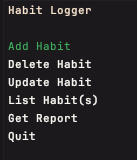

# Habit Logger App



## 📌 Overview
**Habit Logger** is a simple console-based application that helps you track your habits efficiently. You can log habits with custom quantities and units, update them, and generate a summary report. The application features an easy-to-use navigation system using arrow keys and the enter key for selection.

## 🚀 Features
- **Add Habit** – Log any habit by providing a habit, numeric quantity and a custom unit of measure.
- **Delete Habit** – Remove a habit by entering its ID from the listed habits.
- **Update Habit** – Modify a single value (habit name, quantity, or unit) at a time.
- **List Habits** – View all logged habits in a neatly formatted table.
- **Get Report** – Summarize your habits based on the habit name and unit of measure.

## 🎮 How to Use
1. Navigate through the menu using the **arrow keys**.
2. Press **Enter** to select an option.
3. Follow on-screen prompts to add, delete, update, or view your habits.

## 📊 Habit Summary Report
The report groups your logged habits by name and unit of measure, providing a summarized view of your progress.

## ⚡ Requirements
Before running the app, you'll need to ensure that the following software is installed on your machine:

- [.NET 6+ SDK](https://dotnet.microsoft.com/download)
- [SQLite](https://www.sqlite.org/download.html)

### Install .NET SDK
To install the .NET SDK on your machine, follow the instructions for your operating system on the official .NET website:
- For **Windows**: [Install .NET on Windows](https://learn.microsoft.com/en-us/dotnet/core/install/windows)
- For **macOS**: [Install .NET on macOS](https://learn.microsoft.com/en-us/dotnet/core/install/macos)
- For **Linux**: [Install .NET on Linux](https://learn.microsoft.com/en-us/dotnet/core/install/linux)

### Install SQLite
To work with the SQLite database, you must also have SQLite installed:

- Download and install SQLite from the official SQLite website: [SQLite Download](https://www.sqlite.org/download.html)

Once SQLite is installed, ensure the `sqlite3` command is available in your system's PATH.

## 🔧 Setting Up the App

1. **Clone the repository**  
   To clone the app, open your terminal or command prompt and run the following command:

   ```bash
   git clone https://github.com/KamilKolanowski/CodeReviews.Console.HabitTracker.git
