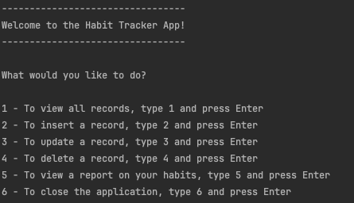

# Habit Logger

This application is a C# console application where users can view, insert,
update and delete records of his habits. Users can also view a report on each
of his habits which summarises the occurrences of that habit. The application 
is written in C# with SQLite as the database.

# Given Requirements
 - This is an application where you’ll log occurrences of a habit.
 - This habit can't be tracked by time (ex. hours of sleep), only by quantity (ex. number of water glasses a day)
 - Users need to be able to input the date of the occurrence of the habit
 - The application should store and retrieve data from a real database
 - When the application starts, it should create a sqlite database, if one isn’t present.
 - It should also create a table in the database, where the habit will be logged.
 - The users should be able to insert, delete, update and view their logged habit. 
 - You should handle all possible errors so that the application never crashes. 
 - You can only interact with the database using ADO.NET. You can’t use mappers such as Entity Framework or Dapper.
 - Your project needs to contain a Read Me file where you'll explain how your app works.

# Features

* SQLite Database connection
  - The application used SQLite as its database
  - The information is stored locally in the `habit_tracker.db` file
  - On program startup, if the database does not exist and/or the table does not exist, 
  the database and/or the table will be created and seeded with random information 

* A console-based UI where users can navigates using commands from the keyboard
  - 