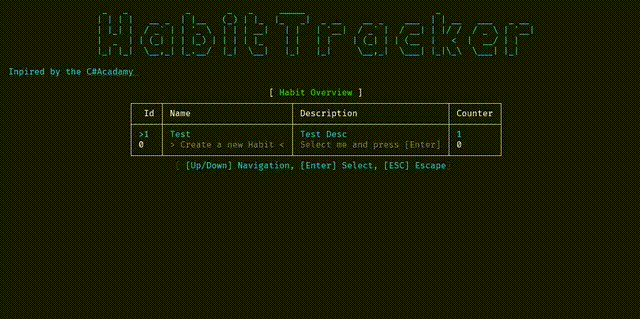

# Habit Tracker App

The Habit Tracker App is a simple console application 
designed to help you manage and track your habits.

Inspired by the [C# Academy Habit Logger Project](https://thecsharpacademy.com/project/12/habit-logger)

## 📸 Overview

## Features

- **Add New Habits:** Create a habit by providing its name,
description, and initial counter value.
- **View Habits:** Display a list of all saved habits with their details.
- **Update Habits:** Edit an existing habit's name, description, or counter.
- **Delete Habits:** Remove a habit from your list.
- **Interactive Interface:** Use keyboard navigation to select 
and interact with habits.

## How It Works

1. Launch the app.
2. Use the arrow keys to navigate through your habits.
3. Press `Enter` to select an habit.
4. Add, update, or delete habits as needed.
5. Exit the app by pressing Escape.

## Technologies Used

- **Spectre.Console:** Interactive console UI.
- **SQLite:** For storing and managing habit data.
- **ADO.NET:** Interaction with the database.